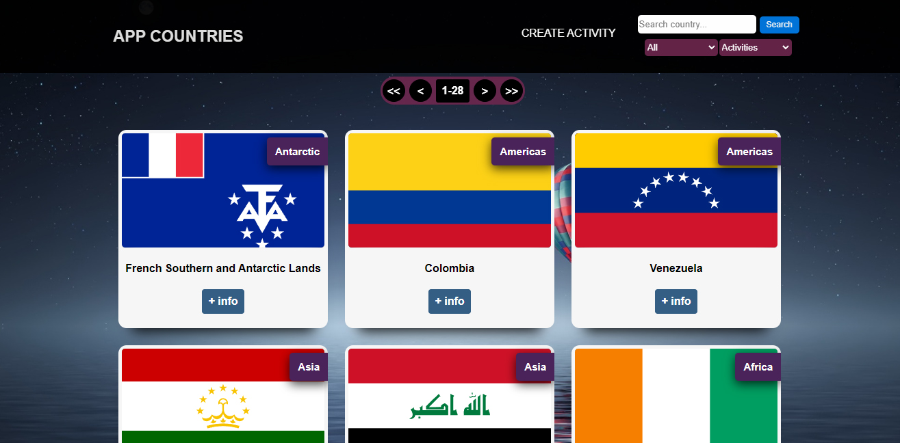
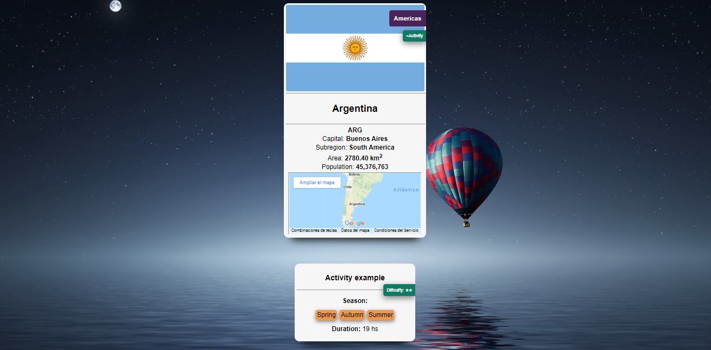
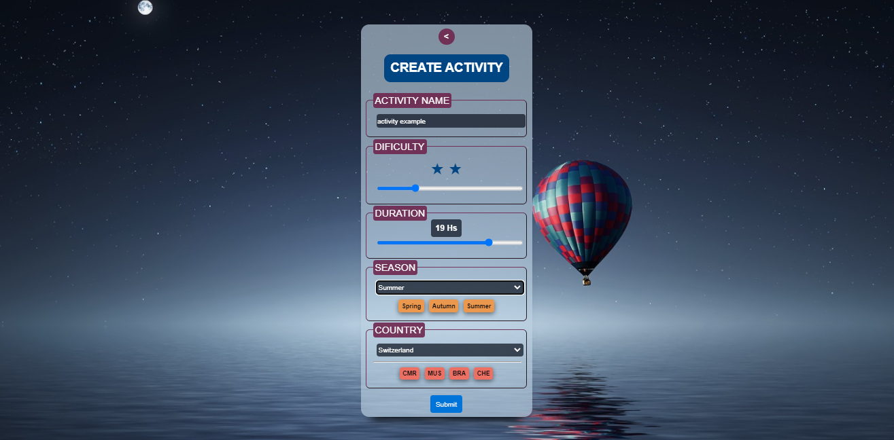
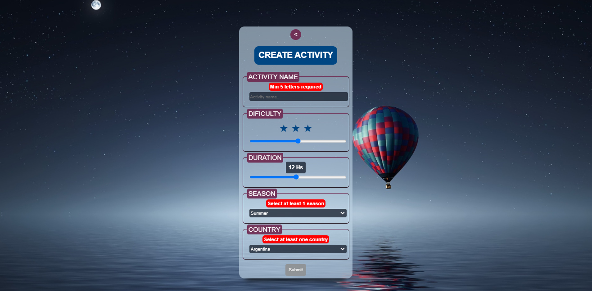

<p align='left'>
    
</p>

# APP Countries - Individual Project (soyHenry)

## APP Countries

App contruida con:
#### Frontend
- [ ] React
- [ ] Redux

#### Backend
- [ ] Node/Express

#### DB
- [ ] Sequelize - Postgres

#### RESTful API
- [ ] REST COUNTRIES v3
- [ ] Endpoint utilizado: https://restcountries.com/v3/all

#### API 
- [ ] Maps Embed API (google)


## Scrennshots

Landing page


Home


Card Detail


Form



## Comenzando

 1. Forkear el repositorio 
 2. Clonar el repositorio en sus computadoras
 3. Configurando la Base de Datos:

  En `api` crear un archivo llamado: `.env` que tenga la siguiente forma:
    ```
    DB_USER=usuariodepostgres
    DB_PASSWORD=passwordDePostgres
    DB_HOST=localhost
    DB_NAME=Nombredelabasededatos
    ```
    Reemplazar `usuariodepostgres` y `passwordDePostgres` con tus propias credenciales de psql.
    Luego deberas crear una base de datos desde psql (puede ser cualquier nombre) y remplazar `Nombredelabasededatos` por el nombre elejido.

  Este archivo va ser ignorado en la subida a github, ya que contiene información sensible

 4. Maps Embed API:

  si se quiere utilizar la API "Maps Embed API" de google. es necesario generar una API_KEY desde: https://developers.google.com/maps/documentation/embed/get-api-key (leer y seguir los pasos)

  una vez generada la API_KEY.

  desde `client` crear un archivo llamado: `.env` que tenga la siguiente forma:
    ```
    REACT_APP_KEY="apikeyMapsEmbed"
    ```
    Reemplazar `apikeyMapsEmbed` por la API_KEY generada. 

 5. Instalando las dependencias y ejecutando el servidor y la App :
    en las carpetas `api` y `client`  abrir la terminal y ejecutar `npm install` y luego `npm start`.

